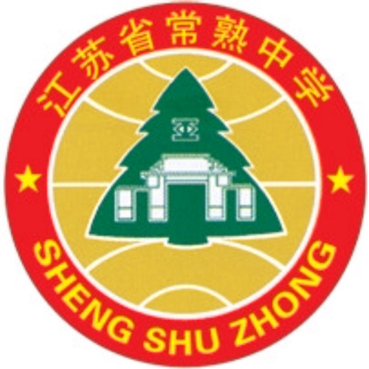
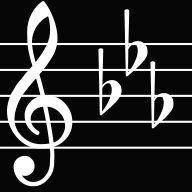

# JPCHS C Minor

                  **x**                 

## What is JPCHS C Minor?

JPCHS is short for "Jiangsu Province Changshu High School". JPCHS C Minor is a club for code lovers from this school and a platform to share our projects with the public.

## Why C Minor?

It is widely recognized that many modern programming languages have their roots in the C programming language. However, we do not take C as a major -- we do not "major C". So we're "C Minors".
