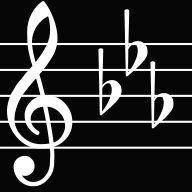

# C Minor

## What is C Minor?

JPCHS is short for "Jiangsu Province Changshu High School". We aim to create a club for code lovers from this school and a platform to share our projects with the public, but we failed due to a lack of members. Now this organization serves as a platform on which coding lovers from this school can still share projects and collabrate.

## Why C Minor?

It is widely recognized that many modern programming languages have their roots in the C programming language. However, we do not take C as a major -- we do not "major C". So, despite the fact that we do not actually "minor" C, we still call ourselves "C Minors".
